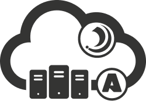

# AMI – Ortus Solutions

This repository contains the official logo assets for AMI distributions including Azure, AWS, Windows, and Ubuntu.

---

## 🖼️ Logo Variants

### Azure AMI

| Variant | Preview | Download |
|----------|----------|----------|
| Full Light |  | SVG: [Download](./SVG/ami-azure-logo-full-light.svg)  **PNG:** [Large](./PNG/ami-azure-logo-full-light-L.png) • [Medium](./PNG/ami-azure-logo-full-light-M.png) • [Small](./PNG/ami-azure-logo-full-light-S.png)  **JPG:** [Large](./JPG/ami-azure-logo-full-light-L.jpg) • [Medium](./JPG/ami-azure-logo-full-light-M.jpg) • [Small](./JPG/ami-azure-logo-full-light-S.jpg) |
| Full Dark |  | SVG: [Download](./SVG/ami-azure-logo-full-dark.svg)  **PNG:** [Large](./PNG/ami-azure-logo-full-dark-L.png) • [Medium](./PNG/ami-azure-logo-full-dark-M.png) • [Small](./PNG/ami-azure-logo-full-dark-S.png)  **JPG:** [Large](./JPG/ami-azure-logo-full-dark-L.jpg) • [Medium](./JPG/ami-azure-logo-full-dark-M.jpg) • [Small](./JPG/ami-azure-logo-full-dark-S.jpg) |
| Mono Light |  | SVG: [Download](./SVG/ami-azure-logo-mono-light.svg)  **PNG:** [Large](./PNG/ami-azure-logo-mono-light-L.png) • [Medium](./PNG/ami-azure-logo-mono-light-M.png) • [Small](./PNG/ami-azure-logo-mono-light-S.png)  **JPG:** [Large](./JPG/ami-azure-logo-mono-light-L.jpg) • [Medium](./JPG/ami-azure-logo-mono-light-M.jpg) • [Small](./JPG/ami-azure-logo-mono-light-S.jpg) |
| Mono Dark |  | SVG: [Download](./SVG/ami-azure-logo-mono-dark.svg)  **PNG:** [Large](./PNG/ami-azure-logo-mono-dark-L.png) • [Medium](./PNG/ami-azure-logo-mono-dark-M.png) • [Small](./PNG/ami-azure-logo-mono-dark-S.png) |

---

### AWS AMI

| Variant | Preview | Download |
|----------|----------|----------|
| Full Light |  | SVG: [Download](./SVG/ami-aws-logo-full-light.svg)  **PNG:** [Large](./PNG/ami-aws-logo-full-light-L.png) • [Medium](./PNG/ami-aws-logo-full-light-M.png) • [Small](./PNG/ami-aws-logo-full-light-S.png)  **JPG:** [Large](./JPG/ami-aws-logo-full-light-L.jpg) • [Medium](./JPG/ami-aws-logo-full-light-M.jpg) • [Small](./JPG/ami-aws-logo-full-light-S.jpg) |
| Full Dark |  | SVG: [Download](./SVG/ami-aws-logo-full-dark.svg)  **PNG:** [Large](./PNG/ami-aws-logo-full-dark-L.png) • [Medium](./PNG/ami-aws-logo-full-dark-M.png) • [Small](./PNG/ami-aws-logo-full-dark-S.png)  **JPG:** [Large](./JPG/ami-aws-logo-full-dark-L.jpg) • [Medium](./JPG/ami-aws-logo-full-dark-M.jpg) • [Small](./JPG/ami-aws-logo-full-dark-S.jpg) |
| Mono Light |  | SVG: [Download](./SVG/ami-aws-logo-mono-light.svg)  **PNG:** [Large](./PNG/ami-aws-logo-mono-light-L.png) • [Medium](./PNG/ami-aws-logo-mono-light-M.png) • [Small](./PNG/ami-aws-logo-mono-light-S.png)  **JPG:** [Large](./JPG/ami-aws-logo-mono-light-L.jpg) • [Medium](./JPG/ami-aws-logo-mono-light-M.jpg) • [Small](./JPG/ami-aws-logo-mono-light-S.jpg) |
| Mono Dark |  | SVG: [Download](./SVG/ami-aws-logo-mono-dark.svg)  **PNG:** [Large](./PNG/ami-aws-logo-mono-dark-L.png) • [Medium](./PNG/ami-aws-logo-mono-dark-M.png) • [Small](./PNG/ami-aws-logo-mono-dark-S.png) |

---

### Windows AMI

| Variant | Preview | Download |
|----------|----------|----------|
| Full Light |  | SVG: [Download](./SVG/ami-windows-logo-full-light.svg)  **PNG:** [Large](./PNG/ami-windows-logo-full-light-L.png) • [Medium](./PNG/ami-windows-logo-full-light-M.png) • [Small](./PNG/ami-windows-logo-full-light-S.png)  **JPG:** [Large](./JPG/ami-windows-logo-full-light-L.jpg) • [Medium](./JPG/ami-windows-logo-full-light-M.jpg) • [Small](./JPG/ami-windows-logo-full-light-S.jpg) |
| Full Dark |  | SVG: [Download](./SVG/ami-windows-logo-full-dark.svg)  **PNG:** [Large](./PNG/ami-windows-logo-full-dark-L.png) • [Medium](./PNG/ami-windows-logo-full-dark-M.png) • [Small](./PNG/ami-windows-logo-full-dark-S.png)  **JPG:** [Large](./JPG/ami-windows-logo-full-dark-L.jpg) • [Medium](./JPG/ami-windows-logo-full-dark-M.jpg) • [Small](./JPG/ami-windows-logo-full-dark-S.jpg) |
| Mono Light |  | SVG: [Download](./SVG/ami-windows-logo-mono-light.svg)  **PNG:** [Large](./PNG/ami-windows-logo-mono-light-L.png) • [Medium](./PNG/ami-windows-logo-mono-light-M.png) • [Small](./PNG/ami-windows-logo-mono-light-S.png)  **JPG:** [Large](./JPG/ami-windows-logo-mono-light-L.jpg) • [Medium](./JPG/ami-windows-logo-mono-light-M.jpg) • [Small](./JPG/ami-windows-logo-mono-light-S.jpg) |
| Mono Dark |  | SVG: [Download](./SVG/ami-windows-logo-mono-dark.svg)  **PNG:** [Large](./PNG/ami-windows-logo-mono-dark-L.png) • [Medium](./PNG/ami-windows-logo-mono-dark-M.png) • [Small](./PNG/ami-windows-logo-mono-dark-S.png) |

---

### Ubuntu AMI

| Variant | Preview | Download |
|----------|----------|----------|
| Full Light |  | SVG: [Download](./SVG/ami-ubuntu-logo-full-light.svg)  **PNG:** [Large](./PNG/ami-ubuntu-logo-full-light-L.png) • [Medium](./PNG/ami-ubuntu-logo-full-light-M.png) • [Small](./PNG/ami-ubuntu-logo-full-light-S.png)  **JPG:** [Large](./JPG/ami-ubuntu-logo-full-light-L.jpg) • [Medium](./JPG/ami-ubuntu-logo-full-light-M.jpg) • [Small](./JPG/ami-ubuntu-logo-full-light-S.jpg) |
| Full Dark |  | SVG: [Download](./SVG/ami-ubuntu-logo-full-dark.svg)  **PNG:** [Large](./PNG/ami-ubuntu-logo-full-dark-L.png) • [Medium](./PNG/ami-ubuntu-logo-full-dark-M.png) • [Small](./PNG/ami-ubuntu-logo-full-dark-S.png)  **JPG:** [Large](./JPG/ami-ubuntu-logo-full-dark-L.jpg) • [Medium](./JPG/ami-ubuntu-logo-full-dark-M.jpg) • [Small](./JPG/ami-ubuntu-logo-full-dark-S.jpg) |
| Mono Light |  | SVG: [Download](./SVG/ami-ubuntu-logo-mono-light.svg)  **PNG:** [Large](./PNG/ami-ubuntu-logo-mono-light-L.png) • [Medium](./PNG/ami-ubuntu-logo-mono-light-M.png) • [Small](./PNG/ami-ubuntu-logo-mono-light-S.png)  **JPG:** [Large](./JPG/ami-ubuntu-logo-mono-light-L.jpg) • [Medium](./JPG/ami-ubuntu-logo-mono-light-M.jpg) • [Small](./JPG/ami-ubuntu-logo-mono-light-S.jpg) |
| Mono Dark |  | SVG: [Download](./SVG/ami-ubuntu-logo-mono-dark.svg)  **PNG:** [Large](./PNG/ami-ubuntu-logo-mono-dark-L.png) • [Medium](./PNG/ami-ubuntu-logo-mono-dark-M.png) • [Small](./PNG/ami-ubuntu-logo-mono-dark-S.png) |

---

## 📝 Notes

- Use **Full Color (Dark Text)** for light backgrounds.  
- Use **Full Color (White Text)** for dark backgrounds.  
- Use **Monochrome** versions when color use is restricted (e.g., single-color print or embossing).  
- File naming convention: **ami-[windows|ubuntu|aws|azure]-[logo|icon]-[variant]-[tone]-[size].[format]**

---

## 🎨 Color Palette

<table>
<tr>
<td align="center">
 
<b>Light</b> 
#33CFFF
</td>
<td align="center">
 
<b>Med</b> 
#0D87C5
</td>
<td align="center">
 
<b>Dark</b> 
#343433
</td>
</tr>
</table>
