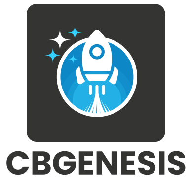

# CBGENESIS

**CBGENESIS** is the foundational platform within the CB ecosystem, designed to power core services, orchestration, and next-generation application workflows.

---

## 🖼️ Logo Variants

| Variant | Preview | Download |
|----------|----------|---------|
| Logo – Full |  | **SVG:** [Large](./SVG/cbgenesis-logo-full-L.svg) • [Medium](./SVG/cbgenesis-logo-full-M.svg) • [Small](./SVG/cbgenesis-logo-full-S.svg) **PNG:** [Large](./PNG/cbgenesis-logo-full-L.png) • [Medium](./PNG/cbgenesis-logo-full-M.png) • [Small](./PNG/cbgenesis-logo-full-S.png) **JPG:** [Large](./JPG/cbgenesis-logo-full-L.jpg) • [Medium](./JPG/cbgenesis-logo-full-M.jpg) • [Small](./JPG/cbgenesis-logo-full-S.jpg) |
| Icon – Full |  | **SVG:** [Large](./SVG/cbgenesis-icon-full-L.svg) • [Medium](./SVG/cbgenesis-icon-full-M.svg) • [Small](./SVG/cbgenesis-icon-full-S.svg) **PNG:** [Large](./PNG/cbgenesis-icon-full-L.png) • [Medium](./PNG/cbgenesis-icon-full-M.png) • [Small](./PNG/cbgenesis-icon-full-S.png) |
| Icon – Mono Dark |  | **SVG:** [Large](./SVG/cbgenesis-icon-mono-dark-L.svg) • [Medium](./SVG/cbgenesis-icon-mono-dark-M.svg) • [Small](./SVG/cbgenesis-icon-mono-dark-S.svg) **PNG:** [Large](./PNG/cbgenesis-icon-mono-dark-L.png) • [Medium](./PNG/cbgenesis-icon-mono-dark-M.png) • [Small](./PNG/cbgenesis-icon-mono-dark-S.png) **JPG:** [Large](./JPG/cbgenesis-icon-mono-dark-L.jpg) • [Medium](./JPG/cbgenesis-icon-mono-dark-M.jpg) • [Small](./JPG/cbgenesis-icon-mono-dark-S.jpg) |
| Icon – Mono Light |  | **SVG:** [Large](./SVG/cbgenesis-icon-mono-light-L.svg) • [Medium](./SVG/cbgenesis-icon-mono-light-M.svg) • [Small](./SVG/cbgenesis-icon-mono-light-S.svg) **PNG:** [Large](./PNG/cbgenesis-icon-mono-light-L.png) • [Medium](./PNG/cbgenesis-icon-mono-light-M.png) • [Small](./PNG/cbgenesis-icon-mono-light-S.png) |

---

## 📝 Notes

- Folders included: `SVG`, `PNG`, `JPG`
- File naming convention:  
  `cbgenesis-[logo|icon]-[variant]-[tone]-[size].[format]`
- Sizes available: **L**, **M**, **S**
- Use **SVG** whenever possible for scalability and best quality.
- Use **PNG** for digital applications.
- Use **JPG** only when required for compatibility.

---

## 🎨 Color Palette

<table>
<tr>
<td align="center">
 
<b>Light</b> 
#33CFFF
</td>
<td align="center">
 
<b>Med</b> 
#0D87C5
</td>
<td align="center">
 
<b>Dark</b> 
#343433
</td>
</tr>
</table>
