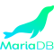
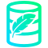

# BOXLANG

Official logo repository for **BoxLang**, the powerful, modern CFML-compatible language from Ortus Solutions.

---

## 🖼️ Logo Variants

<table width="100%">
<tr>
  <th align="left" width="25%">Variant</th>
  <th align="center" width="30%">Preview</th>
  <th align="left" width="20%">Tone / Use</th>
  <th align="left" width="25%">Download</th>
</tr><tr>
  <td>Logo Full Color</td>
  <td align="center">
    
  </td>
  <td>Use on dark backgrounds</td>
  <td>
    <a href="./logo/SVG/boxlang-logo-full-dark.svg">SVG</a> 
    PNG:
    <a href="./logo/PNG/boxlang-logo-full-dark-lg.png">Large</a> · 
    <a href="./logo/PNG/boxlang-logo-full-dark-md.png">Medium</a> · 
    <a href="./logo/PNG/boxlang-logo-full-dark-sm.png">Small</a>
     JPG:
           <a href="./logo/JPG/boxlang-logo-full-dark-lg.jpg">Large</a> · 
           <a href="./logo/JPG/boxlang-logo-full-dark-md.jpg">Medium</a> · 
           <a href="./logo/JPG/boxlang-logo-full-dark-sm.jpg">Small</a>
  </td>
</tr><tr>
  <td>Logo Full Color</td>
  <td align="center">
    
  </td>
  <td>Use on light backgrounds</td>
  <td>
    <a href="./logo/SVG/boxlang-logo-full-light.svg">SVG</a> 
    PNG:
    <a href="./logo/PNG/boxlang-logo-full-light-lg.png">Large</a> · 
    <a href="./logo/PNG/boxlang-logo-full-light-md.png">Medium</a> · 
    <a href="./logo/PNG/boxlang-logo-full-light-sm.png">Small</a>
     JPG:
           <a href="./logo/JPG/boxlang-logo-full-light-lg.jpg">Large</a> · 
           <a href="./logo/JPG/boxlang-logo-full-light-md.jpg">Medium</a> · 
           <a href="./logo/JPG/boxlang-logo-full-light-sm.jpg">Small</a>
  </td>
</tr><tr>
  <td>Logo Monochrome</td>
  <td align="center">
    
  </td>
  <td>Use on dark backgrounds</td>
  <td>
    <a href="./logo/SVG/boxlang-logo-mono-dark.svg">SVG</a> 
    PNG:
    <a href="./logo/PNG/boxlang-logo-mono-dark-lg.png">Large</a> · 
    <a href="./logo/PNG/boxlang-logo-mono-dark-md.png">Medium</a> · 
    <a href="./logo/PNG/boxlang-logo-mono-dark-sm.png">Small</a>
     JPG:
           <a href="./logo/JPG/boxlang-logo-mono-dark-lg.jpg">Large</a> · 
           <a href="./logo/JPG/boxlang-logo-mono-dark-md.jpg">Medium</a> · 
           <a href="./logo/JPG/boxlang-logo-mono-dark-sm.jpg">Small</a>
  </td>
</tr><tr>
  <td>Logo Monochrome</td>
  <td align="center">
    
  </td>
  <td>Use on light backgrounds</td>
  <td>
    <a href="./logo/SVG/boxlang-logo-mono-light.svg">SVG</a> 
    PNG:
    <a href="./logo/PNG/boxlang-logo-mono-light-lg.png">Large</a> · 
    <a href="./logo/PNG/boxlang-logo-mono-light-md.png">Medium</a> · 
    <a href="./logo/PNG/boxlang-logo-mono-light-sm.png">Small</a>
     JPG:
           <a href="./logo/JPG/boxlang-logo-mono-light-lg.jpg">Large</a> · 
           <a href="./logo/JPG/boxlang-logo-mono-light-md.jpg">Medium</a> · 
           <a href="./logo/JPG/boxlang-logo-mono-light-sm.jpg">Small</a>
  </td>
</tr><tr>
  <td>Icon Full Color</td>
  <td align="center">
    
  </td>
  <td></td>
  <td>
    <a href="./logo/SVG/boxlang-icon-full.svg">SVG</a> 
    PNG:
    <a href="./logo/PNG/boxlang-icon-full-lg.png">Large</a> · 
    <a href="./logo/PNG/boxlang-icon-full-md.png">Medium</a> · 
    <a href="./logo/PNG/boxlang-icon-full-sm.png">Small</a>
     JPG:
           <a href="./logo/JPG/boxlang-icon-full-lg.jpg">Large</a> · 
           <a href="./logo/JPG/boxlang-icon-full-md.jpg">Medium</a> · 
           <a href="./logo/JPG/boxlang-icon-full-sm.jpg">Small</a>
  </td>
</tr><tr>
  <td>Icon Monochrome</td>
  <td align="center">
    
  </td>
  <td>Use on dark backgrounds</td>
  <td>
    <a href="./logo/SVG/boxlang-icon-mono-dark.svg">SVG</a> 
    PNG:
    <a href="./logo/PNG/boxlang-icon-mono-dark-lg.png">Large</a> · 
    <a href="./logo/PNG/boxlang-icon-mono-dark-md.png">Medium</a> · 
    <a href="./logo/PNG/boxlang-icon-mono-dark-sm.png">Small</a>
     JPG:
           <a href="./logo/JPG/boxlang-icon-mono-dark-lg.jpg">Large</a> · 
           <a href="./logo/JPG/boxlang-icon-mono-dark-md.jpg">Medium</a> · 
           <a href="./logo/JPG/boxlang-icon-mono-dark-sm.jpg">Small</a>
  </td>
</tr><tr>
  <td>Icon Monochrome</td>
  <td align="center">
    
  </td>
  <td>Use on light backgrounds</td>
  <td>
    <a href="./logo/SVG/boxlang-icon-mono-light.svg">SVG</a> 
    PNG:
    <a href="./logo/PNG/boxlang-icon-mono-light-lg.png">Large</a> · 
    <a href="./logo/PNG/boxlang-icon-mono-light-md.png">Medium</a> · 
    <a href="./logo/PNG/boxlang-icon-mono-light-sm.png">Small</a>
     JPG:
           <a href="./logo/JPG/boxlang-icon-mono-light-lg.jpg">Large</a> · 
           <a href="./logo/JPG/boxlang-icon-mono-light-md.jpg">Medium</a> · 
           <a href="./logo/JPG/boxlang-icon-mono-light-sm.jpg">Small</a>
  </td>
</tr></table>

---

## 📦 Modules

Official modules and extensions available for **BOXLANG**.
<table>
<thead>
<tr>
<th>Preview</th>
<th>Name</th>
<th>Category</th>
<th>Description</th>
<th>Source</th>
<th>Download</th>
</tr>
</thead>
<tbody>
<tr>
<td></td>
<td>bx-compat-cfml</td>
<td>CFML</td>
<td>This module will allow your ColdFusion (CFML) applications under Adobe or Lucee to run under BoxLang.</td>
<td>Open Source</td>
<td><a href="modules/SVG/icon-module-bx-compat-cfml.svg">SVG</a> | <a href="modules/PNG/icon-module-bx-compat-cfml.png">PNG</a> | <a href="modules/JPG/icon-module-bx-compat-cfml.jpg">JPG</a></td>
</tr>
<tr>
<td></td>
<td>bx-yaml</td>
<td>Conversion</td>
<td>Native support for serializing and emiting YAML with BoxLang</td>
<td>Open Source</td>
<td><a href="modules/SVG/icon-module-bx-yaml.svg">SVG</a> | <a href="modules/PNG/icon-module-bx-yaml.png">PNG</a> | <a href="modules/JPG/icon-module-bx-yaml.jpg">JPG</a></td>
</tr>
<tr>
<td></td>
<td>bx-derby</td>
<td>JDBC</td>
<td>This module provides a BoxLang JDBC driver for Apache Derby. This module is part of the BoxLang project.</td>
<td>Open Source</td>
<td><a href="modules/SVG/icon-module-bx-derby.svg">SVG</a> | <a href="modules/PNG/icon-module-bx-derby.png">PNG</a> | <a href="modules/JPG/icon-module-bx-derby.jpg">JPG</a></td>
</tr>
<tr>
<td></td>
<td>bx-esapi</td>
<td>Security</td>
<td>This template can be used to create Ortus based BoxLang Modules.</td>
<td>Open Source</td>
<td><a href="modules/SVG/icon-module-bx-esapi.svg">SVG</a> | <a href="modules/PNG/icon-module-bx-esapi.png">PNG</a> | <a href="modules/JPG/icon-module-bx-esapi.jpg">JPG</a></td>
</tr>
<tr>
<td></td>
<td>bx-hypersql</td>
<td>JDBC</td>
<td>This module provides a BoxLang JDBC driver for HyperSQL.</td>
<td>Open Source</td>
<td><a href="modules/SVG/icon-module-bx-hypersql.svg">SVG</a> | <a href="modules/PNG/icon-module-bx-hypersql.png">PNG</a> | <a href="modules/JPG/icon-module-bx-hypersql.jpg">JPG</a></td>
</tr>
<tr>
<td></td>
<td>bx-mariadb</td>
<td>JDBC</td>
<td>This module provides a BoxLang JDBC driver for MariaDB.</td>
<td>Open Source</td>
<td><a href="modules/SVG/icon-module-bx-mariadb.svg">SVG</a> | <a href="modules/PNG/icon-module-bx-mariadb.png">PNG</a> | <a href="modules/JPG/icon-module-bx-mariadb.jpg">JPG</a></td>
</tr>
<tr>
<td></td>
<td>bx-mssql</td>
<td>JDBC</td>
<td>This module provides a BoxLang JDBC driver for Microsoft SQL Server.</td>
<td>Open Source</td>
<td><a href="modules/SVG/icon-module-bx-mssql.svg">SVG</a> | <a href="modules/PNG/icon-module-bx-mssql.png">PNG</a> | <a href="modules/JPG/icon-module-bx-mssql.jpg">JPG</a></td>
</tr>
<tr>
<td></td>
<td>bx-mysql</td>
<td>JDBC</td>
<td>This module provides a BoxLang JDBC driver for MySQL.</td>
<td>Open Source</td>
<td><a href="modules/SVG/icon-module-bx-mysql.svg">SVG</a> | <a href="modules/PNG/icon-module-bx-mysql.png">PNG</a> | <a href="modules/JPG/icon-module-bx-mysql.jpg">JPG</a></td>
</tr>
<tr>
<td></td>
<td>bx-oracle</td>
<td>JDBC</td>
<td>This module provides a BoxLang JDBC driver for Oracle.</td>
<td>Open Source</td>
<td><a href="modules/SVG/icon-module-bx-oracle.svg">SVG</a> | <a href="modules/PNG/icon-module-bx-oracle.png">PNG</a> | <a href="modules/JPG/icon-module-bx-oracle.jpg">JPG</a></td>
</tr>
<tr>
<td></td>
<td>bx-postgresql</td>
<td>JDBC</td>
<td>This module provides a BoxLang JDBC driver for PostgreSQL.</td>
<td>Open Source</td>
<td><a href="modules/SVG/icon-module-bx-postgresql.svg">SVG</a> | <a href="modules/PNG/icon-module-bx-postgresql.png">PNG</a> | <a href="modules/JPG/icon-module-bx-postgresql.jpg">JPG</a></td>
</tr>
<tr>
<td></td>
<td>bx-image</td>
<td>Image Processing</td>
<td>The module provides numerous components and BIFs for a robust and extensive image manipulation library.</td>
<td>Open Source</td>
<td><a href="modules/SVG/icon-module-bx-image.svg">SVG</a> | <a href="modules/PNG/icon-module-bx-image.png">PNG</a> | <a href="modules/JPG/icon-module-bx-image.jpg">JPG</a></td>
</tr>
<tr>
<td></td>
<td>bx-mail</td>
<td>Communication</td>
<td>The BoxLang mail module provides a robust component and BIFs for sending and interacting with mail services.</td>
<td>Open Source</td>
<td><a href="modules/SVG/icon-module-bx-mail.svg">SVG</a> | <a href="modules/PNG/icon-module-bx-mail.png">PNG</a> | <a href="modules/JPG/icon-module-bx-mail.jpg">JPG</a></td>
</tr>
<tr>
<td></td>
<td>bx-pdf</td>
<td>Document Services</td>
<td>The PDF module enables creating and streaming PDF documents from your BoxLang server code.</td>
<td>Open Source</td>
<td><a href="modules/SVG/icon-module-bx-pdf.svg">SVG</a> | <a href="modules/PNG/icon-module-bx-pdf.png">PNG</a> | <a href="modules/JPG/icon-module-bx-pdf.jpg">JPG</a></td>
</tr>
<tr>
<td></td>
<td>bx-unsafe-evaluate</td>
<td>Compiler</td>
<td>This module will allow you to install an evaluate() function that can execute BoxLang and CFML expressions.</td>
<td>Open Source</td>
<td><a href="modules/SVG/icon-module-bx-unsafe-evaluate.svg">SVG</a> | <a href="modules/PNG/icon-module-bx-unsafe-evaluate.png">PNG</a> | <a href="modules/JPG/icon-module-bx-unsafe-evaluate.jpg">JPG</a></td>
</tr>
<tr>
<td></td>
<td>bx-wddx</td>
<td>Conversion</td>
<td>This module provides the bridge between the WDDX exchange format and BoxLang.</td>
<td>Open Source</td>
<td><a href="modules/SVG/icon-module-bx-wddx.svg">SVG</a> | <a href="modules/PNG/icon-module-bx-wddx.png">PNG</a> | <a href="modules/JPG/icon-module-bx-wddx.jpg">JPG</a></td>
</tr>
<tr>
<td></td>
<td>bx-jython</td>
<td>Scripting</td>
<td>This module allows you to script in Python within BoxLang. It can also execute python scripts and modules</td>
<td>Open Source</td>
<td><a href="modules/SVG/icon-module-bx-jython.svg">SVG</a> | <a href="modules/PNG/icon-module-bx-jython.png">PNG</a> | <a href="modules/JPG/icon-module-bx-jython.jpg">JPG</a></td>
</tr>
<tr>
<td></td>
<td>bx-ini</td>
<td>Operating System</td>
<td>This module allows you to interact with ini files.</td>
<td>Open Source</td>
<td><a href="modules/SVG/icon-module-bx-ini.svg">SVG</a> | <a href="modules/PNG/icon-module-bx-ini.png">PNG</a> | <a href="modules/JPG/icon-module-bx-ini.jpg">JPG</a></td>
</tr>
<tr>
<td></td>
<td>bx-oshi</td>
<td>Operating System</td>
<td>This module is based on the great work of the oshi library. You can use this module to get information about the Operating System and Hardware of the machine you are running on.</td>
<td>Open Source</td>
<td><a href="modules/SVG/icon-module-bx-oshi.svg">SVG</a> | <a href="modules/PNG/icon-module-bx-oshi.png">PNG</a> | <a href="modules/JPG/icon-module-bx-oshi.jpg">JPG</a></td>
</tr>
<tr>
<td></td>
<td>bx-web-support</td>
<td>Testing</td>
<td>This module provides the web support for the BoxLang core OS runtime without the need of a web server.</td>
<td>Open Source</td>
<td><a href="modules/SVG/icon-module-bx-web-support.svg">SVG</a> | <a href="modules/PNG/icon-module-bx-web-support.png">PNG</a> | <a href="modules/JPG/icon-module-bx-web-support.jpg">JPG</a></td>
</tr>
<tr>
<td></td>
<td>bx-ftp</td>
<td>Communication</td>
<td>Module for connecting to and interacting with FTP servers to upload and download files.</td>
<td>Open Source</td>
<td><a href="modules/SVG/icon-module-bx-ftp.svg">SVG</a> | <a href="modules/PNG/icon-module-bx-ftp.png">PNG</a> | <a href="modules/JPG/icon-module-bx-ftp.jpg">JPG</a></td>
</tr>
<tr>
<td></td>
<td>bx-ui-forms</td>
<td>UI</td>
<td>This module contributes several semantic UI components using the BoxLang templating language.</td>
<td>Open Source</td>
<td><a href="modules/SVG/icon-module-bx-ui-forms.svg">SVG</a> | <a href="modules/PNG/icon-module-bx-ui-forms.png">PNG</a> | <a href="modules/JPG/icon-module-bx-ui-forms.jpg">JPG</a></td>
</tr>
<tr>
<td></td>
<td>bx-redis</td>
<td>Caching</td>
<td>This module will enhance your language by having the ability to connect to Redis instances, clusters, or sentinel instances.</td>
<td>BoxLang+/++</td>
<td><a href="modules/SVG/icon-module-bx-redis.svg">SVG</a> | <a href="modules/PNG/icon-module-bx-redis.png">PNG</a> | <a href="modules/JPG/icon-module-bx-redis.jpg">JPG</a></td>
</tr>
<tr>
<td></td>
<td>bx-ai</td>
<td>AI</td>
<td>This module is a BoxLang module that provides AI capabilities to your BoxLang applications.</td>
<td>Open Source</td>
<td><a href="modules/SVG/icon-module-bx-ai.svg">SVG</a> | <a href="modules/PNG/icon-module-bx-ai.png">PNG</a> | <a href="modules/JPG/icon-module-bx-ai.jpg">JPG</a></td>
</tr>
<tr>
<td></td>
<td>bx-orm</td>
<td>ORM</td>
<td>This module enables tight integration with JPA/Hibernate into your BoxLang applications.</td>
<td>Open Source</td>
<td><a href="modules/SVG/icon-module-bx-orm.svg">SVG</a> | <a href="modules/PNG/icon-module-bx-orm.png">PNG</a> | <a href="modules/JPG/icon-module-bx-orm.jpg">JPG</a></td>
</tr>
<tr>
<td></td>
<td>bx-csrf</td>
<td>Security</td>
<td>The CSRF module provides the functionality to generate and verify Cross-Site Request Forgery tokens to Boxlang Web Runtimes.</td>
<td>Open Source</td>
<td><a href="modules/SVG/icon-module-bx-csrf.svg">SVG</a> | <a href="modules/PNG/icon-module-bx-csrf.png">PNG</a> | <a href="modules/JPG/icon-module-bx-csrf.jpg">JPG</a></td>
</tr>
<tr>
<td></td>
<td>bx-markdown</td>
<td>Conversion</td>
<td>This module provides you with native markdown parsing support in your BoxLang applications.</td>
<td>Open Source</td>
<td><a href="modules/SVG/icon-module-bx-markdown.svg">SVG</a> | <a href="modules/PNG/icon-module-bx-markdown.png">PNG</a> | <a href="modules/JPG/icon-module-bx-markdown.jpg">JPG</a></td>
</tr>
<tr>
<td></td>
<td>bx-sqlite</td>
<td>JDBC</td>
<td>This module provides a BoxLang JDBC driver for SQLite.</td>
<td>Open Source</td>
<td><a href="modules/SVG/icon-module-bx-sqlite.svg">SVG</a> | <a href="modules/PNG/icon-module-bx-sqlite.png">PNG</a> | <a href="modules/JPG/icon-module-bx-sqlite.jpg">JPG</a></td>
</tr>
<tr>
<td></td>
<td>bx-jsoup</td>
<td>Document Services</td>
<td>This module enables developers to safely parse, manipulate, and clean HTML content with ease.</td>
<td>Open Source</td>
<td><a href="modules/SVG/icon-module-bx-jsoup.svg">SVG</a> | <a href="modules/PNG/icon-module-bx-jsoup.png">PNG</a> | <a href="modules/JPG/icon-module-bx-jsoup.jpg">JPG</a></td>
</tr>
<tr>
<td></td>
<td>bx-charts</td>
<td>UI</td>
<td>This module provides powerful chart generation capabilities to the BoxLang language, making it easy to create stunning data visualizations with minimal code.</td>
<td>Open Source</td>
<td><a href="modules/SVG/icon-module-bx-charts.svg">SVG</a> | <a href="modules/PNG/icon-module-bx-charts.png">PNG</a> | <a href="modules/JPG/icon-module-bx-charts.jpg">JPG</a></td>
</tr>
<tr>
<td></td>
<td>bx-ldap</td>
<td>Security</td>
<td>This module provides powerful LDAP (Lightweight Directory Access Protocol) capabilities to the BoxLang language, making it easy to query, modify, and manage directory services with minimal code.</td>
<td>BoxLang+/++</td>
<td><a href="modules/SVG/icon-module-bx-ldap.svg">SVG</a> | <a href="modules/PNG/icon-module-bx-ldap.png">PNG</a> | <a href="modules/JPG/icon-module-bx-ldap.jpg">JPG</a></td>
</tr>
<tr>
<td></td>
<td>bx-spreadsheet</td>
<td>Document Services</td>
<td>The BoxLang Spreadsheet module provides a comprehensive and modern API for working with Microsoft Excel files (.xls and .xlsx) in BoxLang.</td>
<td>BoxLang+/++</td>
<td><a href="modules/SVG/icon-module-bx-spreadsheet.svg">SVG</a> | <a href="modules/PNG/icon-module-bx-spreadsheet.png">PNG</a> | <a href="modules/JPG/icon-module-bx-spreadsheet.jpg">JPG</a></td>
</tr>
<tr>
<td></td>
<td>bx-csv</td>
<td>Document Services</td>
<td>The BoxLang CSV module provides a comprehensive and modern API for working with CSV (Comma-Separated Values) files in BoxLang.</td>
<td>BoxLang+/++</td>
<td><a href="modules/SVG/icon-module-bx-csv.svg">SVG</a> | <a href="modules/PNG/icon-module-bx-csv.png">PNG</a> | <a href="modules/JPG/icon-module-bx-csv.jpg">JPG</a></td>
</tr>
<tr>
<td></td>
<td>bx-couchbase</td>
<td>Caching</td>
<td>This module provides enterprise-grade caching, session storage, and AI vector memory capabilities powered by the Couchbase distributed NoSQL database.</td>
<td>BoxLang+/++</td>
<td><a href="modules/SVG/icon-module-couchbase.svg">SVG</a> | <a href="modules/PNG/icon-module-couchbase.png">PNG</a> | <a href="modules/JPG/icon-module-couchbase.jpg">JPG</a></td>
</tr>
<tr>
<td></td>
<td>bx-docbox</td>
<td>Documentation</td>
<td>DocBox is a JavaDoc-style documentation generator for BoxLang codebases, featuring modern HTML themes, JSON output, and UML diagram generation.</td>
<td>Open Source</td>
<td><a href="modules/SVG/icon-module-bx-docbox.svg">SVG</a> | <a href="modules/PNG/icon-module-bx-docbox.png">PNG</a> | <a href="modules/JPG/icon-module-bx-docbox.jpg">JPG</a></td>
</tr>
<tr>
<td></td>
<td>bx-password-encrypt</td>
<td>Security</td>
<td>This module provides secure password encryption and hashing functionality for BoxLang applications using industry-standard algorithms including Argon2, BCrypt, SCrypt, and PBKDF2.</td>
<td>Open Source</td>
<td><a href="modules/SVG/icon-module-bx-password-encrypt.svg">SVG</a> | <a href="modules/PNG/icon-module-bx-password-encrypt.png">PNG</a> | <a href="modules/JPG/icon-module-bx-password-encrypt.jpg">JPG</a></td>
</tr>
<tr>
<td></td>
<td>bx-pdf +</td>
<td>Document Services</td>
<td>PDF generation and manipulation for documents, reports, and forms. This module provides free-tier as well as licensed functionality</td>
<td>BoxLang+/++</td>
<td><a href="modules/SVG/icon-module-bx-pdf-plus.svg">SVG</a> | <a href="modules/PNG/icon-module-bx-pdf-plus.png">PNG</a> | <a href="modules/JPG/icon-module-bx-pdf-plus.jpg">JPG</a></td>
</tr>
<tr>
<td></td>
<td>Meilisearch +</td>
<td>Search Engine</td>
<td>Add native support for the Meilisearch search engine in your BoxLang applications with a fluent, BoxLang-native API wrapper.</td>
<td>BoxLang+/++</td>
<td><a href="modules/SVG/icon-module-meilisearch-plus.svg">SVG</a> | <a href="modules/PNG/icon-module-meilisearch-plus.png">PNG</a> | <a href="modules/JPG/icon-module-meilisearch-plus.jpg">JPG</a></td>
</tr>
<tr>
<td></td>
<td>SOAP Compat +</td>
<td>Web Services</td>
<td>SOAP compatibility layer for generating, parsing, and communicating with web services</td>
<td>BoxLang+/++</td>
<td><a href="modules/SVG/icon-module-soap-compat-plus.svg">SVG</a> | <a href="modules/PNG/icon-module-soap-compat-plus.png">PNG</a> | <a href="modules/JPG/icon-module-soap-compat-plus.jpg">JPG</a></td>
</tr>
<tr>
<td></td>
<td>REST Compat +</td>
<td>API</td>
<td>REST component compatibility and routing translation layer for running legacy framework-less REST architectures</td>
<td>BoxLang+/++</td>
<td><a href="modules/SVG/icon-module-rest-compat-plus.svg">SVG</a> | <a href="modules/PNG/icon-module-rest-compat-plus.png">PNG</a> | <a href="modules/JPG/icon-module-rest-compat-plus.jpg">JPG</a></td>
</tr>
<tr>
<td></td>
<td>JWT +</td>
<td>Security</td>
<td>Premium JWT module for BoxLang+ providing complete JWS signing, JWE encryption, and a fluent token builder with RFC 7518 / RFC 7519 compliance.</td>
<td>BoxLang+/++</td>
<td><a href="modules/SVG/icon-module-jwt-plus.svg">SVG</a> | <a href="modules/PNG/icon-module-jwt-plus.png">PNG</a> | <a href="modules/JPG/icon-module-jwt-plus.jpg">JPG</a></td>
</tr>
<tr>
<td></td>
<td>MCP +</td>
<td>Communication</td>
<td>Model Context Protocol server module for BoxLang runtime diagnostics, introspection, and operational automation.</td>
<td>BoxLang+/++</td>
<td><a href="modules/SVG/icon-module-mcp-plus.svg">SVG</a> | <a href="modules/PNG/icon-module-mcp-plus.png">PNG</a> | <a href="modules/JPG/icon-module-mcp-plus.jpg">JPG</a></td>
</tr>
<tr>
<td></td>
<td>AWS Secrets +</td>
<td>Security</td>
<td>AWS Secrets Manager integration for BoxLang system settings via the aws. namespace in getSystemSetting().</td>
<td>BoxLang+/++</td>
<td><a href="modules/SVG/icon-module-aws-secrets-plus.svg">SVG</a> | <a href="modules/PNG/icon-module-aws-secrets-plus.png">PNG</a> | <a href="modules/JPG/icon-module-aws-secrets-plus.jpg">JPG</a></td>
</tr>
<tr>
<td></td>
<td>Azure Secrets +</td>
<td>Security</td>
<td>Azure Key Vault integration for BoxLang system settings via the azure. namespace in getSystemSetting().</td>
<td>BoxLang+/++</td>
<td><a href="modules/SVG/icon-module-azure-secrets-plus.svg">SVG</a> | <a href="modules/PNG/icon-module-azure-secrets-plus.png">PNG</a> | <a href="modules/JPG/icon-module-azure-secrets-plus.jpg">JPG</a></td>
</tr>
<tr>
<td></td>
<td>Google Secrets +</td>
<td>Security</td>
<td>Google Secret Manager integration for BoxLang system settings via the google. namespace in getSystemSetting().</td>
<td>BoxLang+/++</td>
<td><a href="modules/SVG/icon-module-google-secrets-plus.svg">SVG</a> | <a href="modules/PNG/icon-module-google-secrets-plus.png">PNG</a> | <a href="modules/JPG/icon-module-google-secrets-plus.jpg">JPG</a></td>
</tr>
</tbody>
</table>

---

## 📝 Notes

- Logo variants are designed for specific contexts and usage guidelines.
  - Layout: 
    - default: horizontal, no need to name it in file
    - stack: vertical
    - icon: symbol only
  - Variant: `full` (full color), `mono` (monochrome)
  - Tone: `light`, `dark`
  - Size: `sm`, `md`, `lg`
  - Format: `svg`, `png`, `jpg`

- **Tone refers to usage context (background), not the logo color:**
  - Use **tone: light** for light backgrounds (logo with dark text).
  - Use **tone: dark** for dark backgrounds (logo with light/white text).

- Use **Monochrome** versions when color use is restricted (e.g., single-color print or embossing).  

- File naming convention: **product-[type]-[layout]-[variant]-[tone]-[size].[format]**
 
Example: `boxlang-logo-full-light-md.svg`  
Example (stack): `boxlang-logo-stack-full-dark-md.svg`

---

## 🎨 Color Palette

<table>
  <tr>
    <th>Main</th>
    <th>Second</th>
    <th>Accent</th>
    <th>Dark</th>
  </tr>
  <tr>
    <td align="center">
       
      <b>Hex:</b> #00FF78 
      <b>RGB:</b> 0, 255, 120
    </td>
    <td align="center">
       
      <b>Hex:</b> #00DBFF 
      <b>RGB:</b> 0, 219, 255
    </td>
    <td align="center">
       
      <b>Hex:</b> #FFF500 
      <b>RGB:</b> 255, 245, 0
    </td>
    <td align="center">
       
      <b>Hex:</b> #303446 
      <b>RGB:</b> 48, 52, 70
    </td>
  </tr>
</table>

---

Ortus Brand Book 2025
