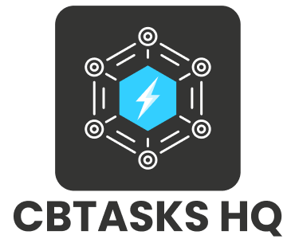

# CBTASKS HQ

Official logo assets for **CBTASKS HQ**, the centralized task management and operational coordination platform within the CB ecosystem.  
This repository contains approved brand assets for dashboards, internal systems, documentation, and operational workflows.

---

## 🎨 Brand Overview

CBTASKS HQ represents productivity, structure, and operational clarity.  
Use the appropriate logo variant depending on background and contrast requirements.

---

## 🖼️ Logo Variants

| Variant | Preview | Files |
|----------|----------|--------|
| Logo – Full |  | [SVG L](./SVG/cbtaskshq-logo-full-L.svg) · [SVG M](./SVG/cbtaskshq-logo-full-M.svg) · [SVG S](./SVG/cbtaskshq-logo-full-S.svg) [PNG L](./PNG/cbtaskshq-logo-full-L.png) · [PNG M](./PNG/cbtaskshq-logo-full-M.png) · [PNG S](./PNG/cbtaskshq-logo-full-S.png) [JPG L](./JPG/cbtaskshq-logo-full-L.jpg) · [JPG M](./JPG/cbtaskshq-logo-full-M.jpg) · [JPG S](./JPG/cbtaskshq-logo-full-S.jpg) |
| Icon – Full |  | [SVG L](./SVG/cbtaskshq-icon-full-L.svg) · [SVG M](./SVG/cbtaskshq-icon-full-M.svg) · [SVG S](./SVG/cbtaskshq-icon-full-S.svg) [PNG L](./PNG/cbtaskshq-icon-full-L.png) · [PNG M](./PNG/cbtaskshq-icon-full-M.png) · [PNG S](./PNG/cbtaskshq-icon-full-S.png) |
| Icon – Mono Dark |  | [SVG L](./SVG/cbtaskshq-icon-mono-dark-L.svg) · [SVG M](./SVG/cbtaskshq-icon-mono-dark-M.svg) · [SVG S](./SVG/cbtaskshq-icon-mono-dark-S.svg) [PNG L](./PNG/cbtaskshq-icon-mono-dark-L.png) · [PNG M](./PNG/cbtaskshq-icon-mono-dark-M.png) · [PNG S](./PNG/cbtaskshq-icon-mono-dark-S.png) [JPG L](./JPG/cbtaskshq-icon-mono-dark-L.jpg) · [JPG M](./JPG/cbtaskshq-icon-mono-dark-M.jpg) · [JPG S](./JPG/cbtaskshq-icon-mono-dark-S.jpg) |
| Icon – Mono Light |  | [SVG L](./SVG/cbtaskshq-icon-mono-light-L.svg) · [SVG M](./SVG/cbtaskshq-icon-mono-light-M.svg) · [SVG S](./SVG/cbtaskshq-icon-mono-light-S.svg) [PNG L](./PNG/cbtaskshq-icon-mono-light-L.png) · [PNG M](./PNG/cbtaskshq-icon-mono-light-M.png) · [PNG S](./PNG/cbtaskshq-icon-mono-light-S.png) |

---

## 📁 Folder Structure

SVG/  
PNG/  
JPG/

---

## ✅ Usage Guidelines

- Prefer **SVG** for product interfaces and dashboards.
- Use **PNG** for documentation and presentations.
- Use **JPG** only when required for compatibility (not available for Icon – Full and Icon – Mono Light).
- Maintain proper spacing and do not alter proportions or colors.
- Do not modify or distort the logo.

---

© CB Ecosystem – CBTASKS HQ Brand Assets
