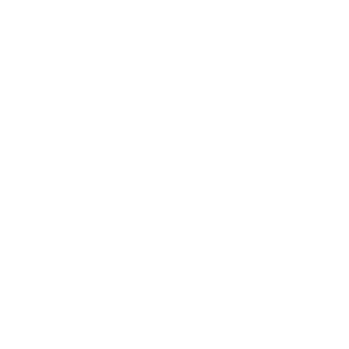

# CBWIRE

Official logo repository for **CBWIRE**, the reactive and modern framework that brings real-time, dynamic interactivity to your ColdBox applications — powered by Ortus Solutions.

---

## 🖼️ Logo Variants

| Variant | Preview | Download |
|----------|----------|----------|
| **Full Color (Dark Text)** |  | SVG: [Download](./SVG/cbwire-logo-full-dark.svg) **PNG:** [Large](./PNG/cbwire-logo-full-dark-L.png) • [Medium](./PNG/cbwire-logo-full-dark-M.png) • [Small](./PNG/cbwire-logo-full-dark-S.png) **JPG:** [Large](./JPG/cbwire-logo-full-dark-L.jpg) • [Medium](./JPG/cbwire-logo-full-dark-M.jpg) • [Small](./JPG/cbwire-logo-full-dark-S.jpg) |
| **Full Color (White Text)** |  | SVG: [Download](./SVG/cbwire-logo-full-light.svg) **PNG:** [Large](./PNG/cbwire-logo-full-light-L.png) • [Medium](./PNG/cbwire-logo-full-light-M.png) • [Small](./PNG/cbwire-logo-full-light-S.png) |
| **Monochrome (Dark)** |  | SVG: [Download](./SVG/cbwire-logo-mono-dark.svg) **PNG:** [Large](./PNG/cbwire-logo-mono-dark-L.png) • [Medium](./PNG/cbwire-logo-mono-dark-M.png) • [Small](./PNG/cbwire-logo-mono-dark-S.png) **JPG:** [Large](./JPG/cbwire-logo-mono-dark-L.jpg) • [Medium](./JPG/cbwire-logo-mono-dark-M.jpg) • [Small](./JPG/cbwire-logo-mono-dark-S.jpg) |
| **Monochrome (White)** |  | SVG: [Download](./SVG/cbwire-logo-mono-light.svg) **PNG:** [Large](./PNG/cbwire-logo-mono-light-L.png) • [Medium](./PNG/cbwire-logo-mono-light-M.png) • [Small](./PNG/cbwire-logo-mono-light-S.png) |
| **Icon – Full Color** |  | SVG: [Download](./SVG/cbwire-icon-full.svg) **PNG:** [Large](./PNG/cbwire-icon-full-L.png) • [Medium](./PNG/cbwire-icon-full-M.png) • [Small](./PNG/cbwire-icon-full-S.png) **JPG:** [Large](./JPG/cbwire-icon-full-L.jpg) • [Medium](./JPG/cbwire-icon-full-M.jpg) • [Small](./JPG/cbwire-icon-full-S.jpg) |
| **Icon – Mono (Dark)** |  | SVG: [Download](./SVG/cbwire-icon-mono-dark.svg) **PNG:** [Large](./PNG/cbwire-icon-mono-dark-L.png) • [Medium](./PNG/cbwire-icon-mono-dark-M.png) • [Small](./PNG/cbwire-icon-mono-dark-S.png) **JPG:** [Large](./JPG/cbwire-icon-mono-dark-L.jpg) • [Medium](./JPG/cbwire-icon-mono-dark-M.jpg) • [Small](./JPG/cbwire-icon-mono-dark-S.jpg) |
| **Icon – Mono (White)** |  | SVG: [Download](./SVG/cbwire-icon-mono-light.svg) **PNG:** [Large](./PNG/cbwire-icon-mono-light-L.png) • [Medium](./PNG/cbwire-icon-mono-light-M.png) • [Small](./PNG/cbwire-icon-mono-light-S.png) |

---

## 📝 Notes

- Use **Full Color (Dark Text)** for light backgrounds.  
- Use **Full Color (White Text)** for dark backgrounds.  
- Use **Monochrome** versions when color use is restricted (e.g., single-color print or embossing).  
- File naming convention: **cbwire-[logo|icon]-[variant]-[tone]-[size].[format]**

Example: cbwire-logo-full-dark-M.svg

---

## 🎨 Color Palette  

<table>
  <tr>
    <th>Light</th>
    <th>Med</th>
    <th>Dark</th>
  </tr>
  <tr>
    <td align="center">
       
      <b>Hex:</b> #33CFFF 
      <b>RGB:</b> 51, 207, 255
    </td>
    <td align="center">
       
      <b>Hex:</b> #0D87C5 
      <b>RGB:</b> 13, 135, 197
    </td>
    <td align="center">
       
      <b>Hex:</b> #1D3366 
      <b>RGB:</b> 29, 51, 102
    </td>
  </tr>
</table>

---

Ortus Brand Book 2025
