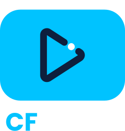
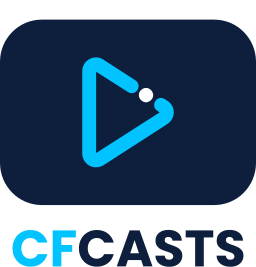

# CFCasts Theme

**CFCASTS** is an online learning platform within the Ortus Solutions ecosystem, focused on teaching CFML and modern web development through structured video courses, tutorials, and practical examples.

## 🖼️ Logo Variants

<table width="100%">
<tr>
  <th align="left" width="25%">Variant</th>
  <th align="center" width="30%">Preview</th>
  <th align="left" width="20%">Tone / Use</th>
  <th align="left" width="25%">Download</th>
</tr><tr>
  <td>Logo Full Color</td>
  <td align="center">
    
  </td>
  <td>Use on dark backgrounds</td>
  <td>
    <a href="./SVG/cfcasts-logo-full-dark.svg">SVG</a> 
    PNG:
    <a href="./PNG/cfcasts-logo-full-dark-lg.png">Large</a> · 
    <a href="./PNG/cfcasts-logo-full-dark-md.png">Medium</a> · 
    <a href="./PNG/cfcasts-logo-full-dark-sm.png">Small</a>
     JPG:
           <a href="./JPG/cfcasts-logo-full-dark-lg.jpg">Large</a> · 
           <a href="./JPG/cfcasts-logo-full-dark-md.jpg">Medium</a> · 
           <a href="./JPG/cfcasts-logo-full-dark-sm.jpg">Small</a>
  </td>
</tr><tr>
  <td>Logo Full Color</td>
  <td align="center">
    
  </td>
  <td>Use on light backgrounds</td>
  <td>
    <a href="./SVG/cfcasts-logo-full-light.svg">SVG</a> 
    PNG:
    <a href="./PNG/cfcasts-logo-full-light-lg.png">Large</a> · 
    <a href="./PNG/cfcasts-logo-full-light-md.png">Medium</a> · 
    <a href="./PNG/cfcasts-logo-full-light-sm.png">Small</a>
     JPG:
           <a href="./JPG/cfcasts-logo-full-light-lg.jpg">Large</a> · 
           <a href="./JPG/cfcasts-logo-full-light-md.jpg">Medium</a> · 
           <a href="./JPG/cfcasts-logo-full-light-sm.jpg">Small</a>
  </td>
</tr><tr>
  <td>Logo Monochrome</td>
  <td align="center">
    
  </td>
  <td>Use on dark backgrounds</td>
  <td>
    <a href="./SVG/cfcasts-logo-mono-dark.svg">SVG</a> 
    PNG:
    <a href="./PNG/cfcasts-logo-mono-dark-lg.png">Large</a> · 
    <a href="./PNG/cfcasts-logo-mono-dark-md.png">Medium</a> · 
    <a href="./PNG/cfcasts-logo-mono-dark-sm.png">Small</a>
     JPG:
           <a href="./JPG/cfcasts-logo-mono-dark-lg.jpg">Large</a> · 
           <a href="./JPG/cfcasts-logo-mono-dark-md.jpg">Medium</a> · 
           <a href="./JPG/cfcasts-logo-mono-dark-sm.jpg">Small</a>
  </td>
</tr><tr>
  <td>Logo Monochrome</td>
  <td align="center">
    
  </td>
  <td>Use on light backgrounds</td>
  <td>
    <a href="./SVG/cfcasts-logo-mono-light.svg">SVG</a> 
    PNG:
    <a href="./PNG/cfcasts-logo-mono-light-lg.png">Large</a> · 
    <a href="./PNG/cfcasts-logo-mono-light-md.png">Medium</a> · 
    <a href="./PNG/cfcasts-logo-mono-light-sm.png">Small</a>
     JPG:
           <a href="./JPG/cfcasts-logo-mono-light-lg.jpg">Large</a> · 
           <a href="./JPG/cfcasts-logo-mono-light-md.jpg">Medium</a> · 
           <a href="./JPG/cfcasts-logo-mono-light-sm.jpg">Small</a>
  </td>
</tr><tr>
  <td>Logo Stack Full Color</td>
  <td align="center">
    
  </td>
  <td>Use on dark backgrounds</td>
  <td>
    <a href="./SVG/cfcasts-logo-stack-full-dark.svg">SVG</a> 
    PNG:
    <a href="./PNG/cfcasts-logo-stack-full-dark-lg.png">Large</a> · 
    <a href="./PNG/cfcasts-logo-stack-full-dark-md.png">Medium</a> · 
    <a href="./PNG/cfcasts-logo-stack-full-dark-sm.png">Small</a>
     JPG:
           <a href="./JPG/cfcasts-logo-stack-full-dark-lg.jpg">Large</a> · 
           <a href="./JPG/cfcasts-logo-stack-full-dark-md.jpg">Medium</a> · 
           <a href="./JPG/cfcasts-logo-stack-full-dark-sm.jpg">Small</a>
  </td>
</tr><tr>
  <td>Logo Stack Full Color</td>
  <td align="center">
    
  </td>
  <td>Use on light backgrounds</td>
  <td>
    <a href="./SVG/cfcasts-logo-stack-full-light.svg">SVG</a> 
    PNG:
    <a href="./PNG/cfcasts-logo-stack-full-light-lg.png">Large</a> · 
    <a href="./PNG/cfcasts-logo-stack-full-light-md.png">Medium</a> · 
    <a href="./PNG/cfcasts-logo-stack-full-light-sm.png">Small</a>
     JPG:
           <a href="./JPG/cfcasts-logo-stack-full-light-lg.jpg">Large</a> · 
           <a href="./JPG/cfcasts-logo-stack-full-light-md.jpg">Medium</a> · 
           <a href="./JPG/cfcasts-logo-stack-full-light-sm.jpg">Small</a>
  </td>
</tr><tr>
  <td>Logo Stack Monochrome</td>
  <td align="center">
    
  </td>
  <td>Use on dark backgrounds</td>
  <td>
    <a href="./SVG/cfcasts-logo-stack-mono-dark.svg">SVG</a> 
    PNG:
    <a href="./PNG/cfcasts-logo-stack-mono-dark-lg.png">Large</a> · 
    <a href="./PNG/cfcasts-logo-stack-mono-dark-md.png">Medium</a> · 
    <a href="./PNG/cfcasts-logo-stack-mono-dark-sm.png">Small</a>
     JPG:
           <a href="./JPG/cfcasts-logo-stack-mono-dark-lg.jpg">Large</a> · 
           <a href="./JPG/cfcasts-logo-stack-mono-dark-md.jpg">Medium</a> · 
           <a href="./JPG/cfcasts-logo-stack-mono-dark-sm.jpg">Small</a>
  </td>
</tr><tr>
  <td>Logo Stack Monochrome</td>
  <td align="center">
    
  </td>
  <td>Use on light backgrounds</td>
  <td>
    <a href="./SVG/cfcasts-logo-stack-mono-light.svg">SVG</a> 
    PNG:
    <a href="./PNG/cfcasts-logo-stack-mono-light-lg.png">Large</a> · 
    <a href="./PNG/cfcasts-logo-stack-mono-light-md.png">Medium</a> · 
    <a href="./PNG/cfcasts-logo-stack-mono-light-sm.png">Small</a>
     JPG:
           <a href="./JPG/cfcasts-logo-stack-mono-light-lg.jpg">Large</a> · 
           <a href="./JPG/cfcasts-logo-stack-mono-light-md.jpg">Medium</a> · 
           <a href="./JPG/cfcasts-logo-stack-mono-light-sm.jpg">Small</a>
  </td>
</tr><tr>
  <td>Icon Full Color</td>
  <td align="center">
    
  </td>
  <td>Use on dark backgrounds</td>
  <td>
    <a href="./SVG/cfcasts-icon-full-dark.svg">SVG</a> 
    PNG:
    <a href="./PNG/cfcasts-icon-full-dark-lg.png">Large</a> · 
    <a href="./PNG/cfcasts-icon-full-dark-md.png">Medium</a> · 
    <a href="./PNG/cfcasts-icon-full-dark-sm.png">Small</a>
     JPG:
           <a href="./JPG/cfcasts-icon-full-dark-lg.jpg">Large</a> · 
           <a href="./JPG/cfcasts-icon-full-dark-md.jpg">Medium</a> · 
           <a href="./JPG/cfcasts-icon-full-dark-sm.jpg">Small</a>
  </td>
</tr><tr>
  <td>Icon Full Color</td>
  <td align="center">
    
  </td>
  <td>Use on light backgrounds</td>
  <td>
    <a href="./SVG/cfcasts-icon-full-light.svg">SVG</a> 
    PNG:
    <a href="./PNG/cfcasts-icon-full-light-lg.png">Large</a> · 
    <a href="./PNG/cfcasts-icon-full-light-md.png">Medium</a> · 
    <a href="./PNG/cfcasts-icon-full-light-sm.png">Small</a>
     JPG:
           <a href="./JPG/cfcasts-icon-full-light-lg.jpg">Large</a> · 
           <a href="./JPG/cfcasts-icon-full-light-md.jpg">Medium</a> · 
           <a href="./JPG/cfcasts-icon-full-light-sm.jpg">Small</a>
  </td>
</tr><tr>
  <td>Icon Monochrome</td>
  <td align="center">
    
  </td>
  <td>Use on dark backgrounds</td>
  <td>
    <a href="./SVG/cfcasts-icon-mono-dark.svg">SVG</a> 
    PNG:
    <a href="./PNG/cfcasts-icon-mono-dark-lg.png">Large</a> · 
    <a href="./PNG/cfcasts-icon-mono-dark-md.png">Medium</a> · 
    <a href="./PNG/cfcasts-icon-mono-dark-sm.png">Small</a>
     JPG:
           <a href="./JPG/cfcasts-icon-mono-dark-lg.jpg">Large</a> · 
           <a href="./JPG/cfcasts-icon-mono-dark-md.jpg">Medium</a> · 
           <a href="./JPG/cfcasts-icon-mono-dark-sm.jpg">Small</a>
  </td>
</tr><tr>
  <td>Icon Monochrome</td>
  <td align="center">
    
  </td>
  <td>Use on light backgrounds</td>
  <td>
    <a href="./SVG/cfcasts-icon-mono-light.svg">SVG</a> 
    PNG:
    <a href="./PNG/cfcasts-icon-mono-light-lg.png">Large</a> · 
    <a href="./PNG/cfcasts-icon-mono-light-md.png">Medium</a> · 
    <a href="./PNG/cfcasts-icon-mono-light-sm.png">Small</a>
     JPG:
           <a href="./JPG/cfcasts-icon-mono-light-lg.jpg">Large</a> · 
           <a href="./JPG/cfcasts-icon-mono-light-md.jpg">Medium</a> · 
           <a href="./JPG/cfcasts-icon-mono-light-sm.jpg">Small</a>
  </td>
</tr></table>

---

## 📝 Notes

- Logo variants are designed for specific contexts and usage guidelines.
  - Layout: 
    - default: horizontal, no need to name it in file
    - stack: vertical
    - icon: symbol only
  - Variant: `full` (full color), `mono` (monochrome)
  - Tone: `light`, `dark`
  - Size: `sm`, `md`, `lg`
  - Format: `svg`, `png`, `jpg`

- **Tone refers to usage context (background), not the logo color:**
  - Use **tone: light** for light backgrounds (logo with dark text).
  - Use **tone: dark** for dark backgrounds (logo with light/white text).

- Use **Monochrome** versions when color use is restricted (e.g., single-color print or embossing).  

- File naming convention: **product-[type]-[layout]-[variant]-[tone]-[size].[format]**
 
Example: `cfcasts-logo-full-light-md.svg`  
Example (stack): `cfcasts-logo-stack-full-dark-md.svg`

---

## 🎨 Color Palette

<table>
<tr>
<td align="center">
 
<strong>Light</strong> 
#00C3FF
</td>
<td align="center">
 
<strong>Med</strong> 
#0066FF
</td>
</td>
<td align="center">
 
<strong>Dark</strong> 
#0E1F3D
</td>
</tr>
</table>
