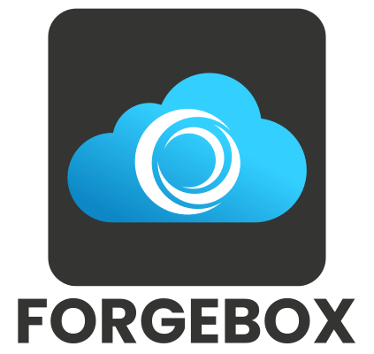

# ForgeBox

Official logo repository for **ForgeBox** — the Ortus Solutions package management and storage platform for modern CFML and BOXLANG applications.

---

## 🖼️ Logo Variants

| Variant | Preview | Files |
|----------|----------|--------|
| **Full Logo** |  | **SVG:** [Large](./SVG/forgebox-logo-full-L.svg) • [Medium](./SVG/forgebox-logo-full-M.svg) • [Small](./SVG/forgebox-logo-full-S.svg) **PNG:** [Large](./PNG/forgebox-logo-full-L.png) • [Medium](./PNG/forgebox-logo-full-M.png) • [Small](./PNG/forgebox-logo-full-S.png) **JPG:** [Large](./JPG/forgebox-logo-full-L.jpg) • [Medium](./JPG/forgebox-logo-full-M.jpg) • [Small](./JPG/forgebox-logo-full-S.jpg) |
| **Icon – Full Color** |  | **SVG:** [Large](./SVG/forgebox-icon-full-L.svg) • [Medium](./SVG/forgebox-icon-full-M.svg) • [Small](./SVG/forgebox-icon-full-S.svg) **PNG:** [Large](./PNG/forgebox-icon-full-L.png) • [Medium](./PNG/forgebox-icon-full-M.png) • [Small](./PNG/forgebox-icon-full-S.png) **JPG:** [Large](./JPG/forgebox-icon-full-L.jpg) • [Medium](./JPG/forgebox-icon-full-M.jpg) • [Small](./JPG/forgebox-icon-full-S.jpg) |
| **Icon – Mono (Dark)** |  | **SVG:** [Large](./SVG/forgebox-icon-mono-dark-L.svg) • [Medium](./SVG/forgebox-icon-mono-dark-M.svg) • [Small](./SVG/forgebox-icon-mono-dark-S.svg) **PNG:** [Large](./PNG/forgebox-icon-mono-dark-L.png) • [Medium](./PNG/forgebox-icon-mono-dark-M.png) • [Small](./PNG/forgebox-icon-mono-dark-S.png) **JPG:** [Large](./JPG/forgebox-icon-mono-dark-L.jpg) • [Medium](./JPG/forgebox-icon-mono-dark-M.jpg) • [Small](./JPG/forgebox-icon-mono-dark-S.jpg) |
| **Icon – Mono (Light)** |  | **SVG:** [Large](./SVG/forgebox-icon-mono-light-L.svg) • [Medium](./SVG/forgebox-icon-mono-light-M.svg) • [Small](./SVG/forgebox-icon-mono-light-S.svg) **PNG:** [Large](./PNG/forgebox-icon-mono-light-L.png) • [Medium](./PNG/forgebox-icon-mono-light-M.png) • [Small](./PNG/forgebox-icon-mono-light-S.png) **JPG:** [Large](./JPG/forgebox-icon-mono-light-L.jpg) • [Medium](./JPG/forgebox-icon-mono-light-M.jpg) • [Small](./JPG/forgebox-icon-mono-light-S.jpg) |

---

## 📝 Notes

- Use **Full Logo** for standard branding and marketing materials.  
- Use **Icon** versions when a simplified or compact representation is required.  
- File naming convention: **forgebox-[logo|icon]-[variant]-[size].[format]**

Example: `forgebox-logo-full-M.svg`

---

## 🎨 Color Palette  

<table>
  <tr>
    <th>Light</th>
    <th>Med</th>
    <th>Dark</th>
  </tr>
  <tr>
    <td align="center">
       
      <b>Hex:</b> #33CFFF 
      <b>RGB:</b> 51, 207, 255
    </td>
    <td align="center">
       
      <b>Hex:</b> #0D87C5 
      <b>RGB:</b> 13, 135, 197
    </td>
    <td align="center">
       
      <b>Hex:</b> #343433 
      <b>RGB:</b> 52, 52, 51
    </td>
  </tr>
</table>

---

Ortus Brand Book 2025
