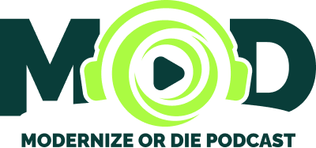
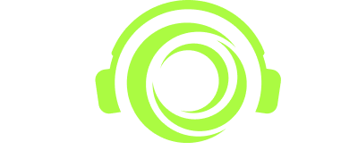
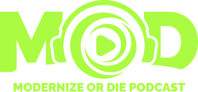

# MOD - Modernize Or Die Podcast

**MOD (Modernize Or Die Podcast)** is a tech podcast focused on modern development, tooling, and best practices across the software ecosystem.  

---

## 🖼️ Logo Variants

| Variant | Preview | Download |
|----------|----------|----------|
| Logo – Full Light |  | SVG: [Download](./SVG/mod-logo-full-light.svg) **PNG:** [Large](./PNG/mod-logo-full-light-L.png) • [Medium](./PNG/mod-logo-full-light-M.png) • [Small](./PNG/mod-logo-full-light-S.png) **JPG:** [Large](./JPG/mod-logo-full-light-L.jpg) • [Medium](./JPG/mod-logo-full-light-M.jpg) • [Small](./JPG/mod-logo-full-light-S.jpg) |
| Logo – Full Dark |  | SVG: [Download](./SVG/mod-logo-full-dark.svg) **PNG:** [Large](./PNG/mod-logo-full-dark-L.png) • [Medium](./PNG/mod-logo-full-dark-M.png) • [Small](./PNG/mod-logo-full-dark-S.png) |
| Logo – Mono Light |  | SVG: [Download](./SVG/mod-logo-mono-light.svg) **PNG:** [Large](./PNG/mod-logo-mono-light-L.png) • [Medium](./PNG/mod-logo-mono-light-M.png) • [Small](./PNG/mod-logo-mono-light-S.png) **JPG:** [Large](./JPG/mod-logo-mono-light-L.jpg) • [Medium](./JPG/mod-logo-mono-light-M.jpg) • [Small](./JPG/mod-logo-mono-light-S.jpg) |
| Logo – Mono Dark |  | SVG: [Download](./SVG/mod-logo-mono-dark.svg) **PNG:** [Large](./PNG/mod-logo-mono-dark-L.png) • [Medium](./PNG/mod-logo-mono-dark-M.png) • [Small](./PNG/mod-logo-mono-dark-S.png) |

---

## 📝 Notes

- Use Full Color (Dark Text) for light backgrounds.
- Use Full Color (White Text) for dark backgrounds.
- Use Monochrome versions when color use is restricted (e.g., single-color print or embossing).
- Naming convention: `mod-logo-[variant]-[size].[format]`

---

## 🎨 Color Palette

<table>
  <tr>
    <th>Light</th>
    <th>Med</th>
    <th>Dark</th>
    <th>Accent</th>
  </tr>
  <tr>
    <td align="center">
       
      <b>Hex:</b> #ABFB42
    </td>
    <td align="center">
       
      <b>Hex:</b> #00FFB7
    </td>
    <td align="center">
       
      <b>Hex:</b> #093D39
    </td>
    <td align="center">
       
      <b>Hex:</b> #564CB7
    </td>
  </tr>
</table>
