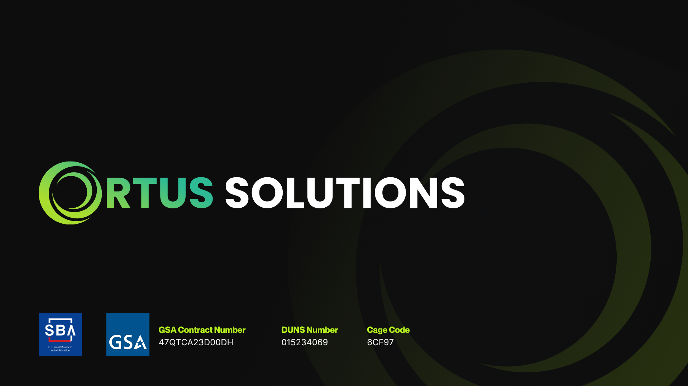

# Ortus

Official logo repository for **Ortus Solutions** — the creative force behind the modern CFML and BOXLANG ecosystem, empowering developers worldwide with innovative tools, training, and open-source technologies.

---

## 🖼️ Logo Variants

<table width="100%">
<tr>
  <th align="left" width="25%">Variant</th>
  <th align="center" width="30%">Preview</th>
  <th align="left" width="20%">Tone / Use</th>
  <th align="left" width="25%">Download</th>
</tr><tr>
  <td>Logo Full Color</td>
  <td align="center">
    
  </td>
  <td>Use on dark backgrounds</td>
  <td>
    <a href="./SVG/ortus-logo-base-full-dark.svg">SVG</a> 
    PNG:
    <a href="./PNG/ortus-logo-base-full-dark-lg.png">Large</a> · 
    <a href="./PNG/ortus-logo-base-full-dark-md.png">Medium</a> · 
    <a href="./PNG/ortus-logo-base-full-dark-sm.png">Small</a>
     JPG:
           <a href="./JPG/ortus-logo-base-full-dark-lg.jpg">Large</a> · 
           <a href="./JPG/ortus-logo-base-full-dark-md.jpg">Medium</a> · 
           <a href="./JPG/ortus-logo-base-full-dark-sm.jpg">Small</a>
  </td>
</tr><tr>
  <td>Logo Full Color</td>
  <td align="center">
    
  </td>
  <td>Use on light backgrounds</td>
  <td>
    <a href="./SVG/ortus-logo-base-full-light.svg">SVG</a> 
    PNG:
    <a href="./PNG/ortus-logo-base-full-light-lg.png">Large</a> · 
    <a href="./PNG/ortus-logo-base-full-light-md.png">Medium</a> · 
    <a href="./PNG/ortus-logo-base-full-light-sm.png">Small</a>
     JPG:
           <a href="./JPG/ortus-logo-base-full-light-lg.jpg">Large</a> · 
           <a href="./JPG/ortus-logo-base-full-light-md.jpg">Medium</a> · 
           <a href="./JPG/ortus-logo-base-full-light-sm.jpg">Small</a>
  </td>
</tr><tr>
  <td>Logo Monochrome</td>
  <td align="center">
    
  </td>
  <td>Use on dark backgrounds</td>
  <td>
    <a href="./SVG/ortus-logo-base-mono-dark.svg">SVG</a> 
    PNG:
    <a href="./PNG/ortus-logo-base-mono-dark-lg.png">Large</a> · 
    <a href="./PNG/ortus-logo-base-mono-dark-md.png">Medium</a> · 
    <a href="./PNG/ortus-logo-base-mono-dark-sm.png">Small</a>
     JPG:
           <a href="./JPG/ortus-logo-base-mono-dark-lg.jpg">Large</a> · 
           <a href="./JPG/ortus-logo-base-mono-dark-md.jpg">Medium</a> · 
           <a href="./JPG/ortus-logo-base-mono-dark-sm.jpg">Small</a>
  </td>
</tr><tr>
  <td>Logo Monochrome</td>
  <td align="center">
    
  </td>
  <td>Use on light backgrounds</td>
  <td>
    <a href="./SVG/ortus-logo-base-mono-light.svg">SVG</a> 
    PNG:
    <a href="./PNG/ortus-logo-base-mono-light-lg.png">Large</a> · 
    <a href="./PNG/ortus-logo-base-mono-light-md.png">Medium</a> · 
    <a href="./PNG/ortus-logo-base-mono-light-sm.png">Small</a>
     JPG:
           <a href="./JPG/ortus-logo-base-mono-light-lg.jpg">Large</a> · 
           <a href="./JPG/ortus-logo-base-mono-light-md.jpg">Medium</a> · 
           <a href="./JPG/ortus-logo-base-mono-light-sm.jpg">Small</a>
  </td>
</tr><tr>
  <td>Logo Full Color</td>
  <td align="center">
    
  </td>
  <td>Use on dark backgrounds</td>
  <td>
    <a href="./SVG/ortus-logo-full-dark.svg">SVG</a> 
    PNG:
    <a href="./PNG/ortus-logo-full-dark-lg.png">Large</a> · 
    <a href="./PNG/ortus-logo-full-dark-md.png">Medium</a> · 
    <a href="./PNG/ortus-logo-full-dark-sm.png">Small</a>
     JPG:
           <a href="./JPG/ortus-logo-full-dark-lg.jpg">Large</a> · 
           <a href="./JPG/ortus-logo-full-dark-md.jpg">Medium</a> · 
           <a href="./JPG/ortus-logo-full-dark-sm.jpg">Small</a>
  </td>
</tr><tr>
  <td>Logo Full Color</td>
  <td align="center">
    
  </td>
  <td>Use on light backgrounds</td>
  <td>
    <a href="./SVG/ortus-logo-full-light.svg">SVG</a> 
    PNG:
    <a href="./PNG/ortus-logo-full-light-lg.png">Large</a> · 
    <a href="./PNG/ortus-logo-full-light-md.png">Medium</a> · 
    <a href="./PNG/ortus-logo-full-light-sm.png">Small</a>
     JPG:
           <a href="./JPG/ortus-logo-full-light-lg.jpg">Large</a> · 
           <a href="./JPG/ortus-logo-full-light-md.jpg">Medium</a> · 
           <a href="./JPG/ortus-logo-full-light-sm.jpg">Small</a>
  </td>
</tr><tr>
  <td>Logo Monochrome</td>
  <td align="center">
    
  </td>
  <td>Use on dark backgrounds</td>
  <td>
    <a href="./SVG/ortus-logo-mono-dark.svg">SVG</a> 
    PNG:
    <a href="./PNG/ortus-logo-mono-dark-lg.png">Large</a> · 
    <a href="./PNG/ortus-logo-mono-dark-md.png">Medium</a> · 
    <a href="./PNG/ortus-logo-mono-dark-sm.png">Small</a>
     JPG:
           <a href="./JPG/ortus-logo-mono-dark-lg.jpg">Large</a> · 
           <a href="./JPG/ortus-logo-mono-dark-md.jpg">Medium</a> · 
           <a href="./JPG/ortus-logo-mono-dark-sm.jpg">Small</a>
  </td>
</tr><tr>
  <td>Logo Monochrome</td>
  <td align="center">
    
  </td>
  <td>Use on light backgrounds</td>
  <td>
    <a href="./SVG/ortus-logo-mono-light.svg">SVG</a> 
    PNG:
    <a href="./PNG/ortus-logo-mono-light-lg.png">Large</a> · 
    <a href="./PNG/ortus-logo-mono-light-md.png">Medium</a> · 
    <a href="./PNG/ortus-logo-mono-light-sm.png">Small</a>
     JPG:
           <a href="./JPG/ortus-logo-mono-light-lg.jpg">Large</a> · 
           <a href="./JPG/ortus-logo-mono-light-md.jpg">Medium</a> · 
           <a href="./JPG/ortus-logo-mono-light-sm.jpg">Small</a>
  </td>
</tr><tr>
  <td>Icon Full Color</td>
  <td align="center">
    
  </td>
  <td></td>
  <td>
    <a href="./SVG/ortus-icon-full.svg">SVG</a> 
    PNG:
    <a href="./PNG/ortus-icon-full-lg.png">Large</a> · 
    <a href="./PNG/ortus-icon-full-md.png">Medium</a> · 
    <a href="./PNG/ortus-icon-full-sm.png">Small</a>
     JPG:
           <a href="./JPG/ortus-icon-full-lg.jpg">Large</a> · 
           <a href="./JPG/ortus-icon-full-md.jpg">Medium</a> · 
           <a href="./JPG/ortus-icon-full-sm.jpg">Small</a>
  </td>
</tr><tr>
  <td>Icon Monochrome</td>
  <td align="center">
    
  </td>
  <td>Use on dark backgrounds</td>
  <td>
    <a href="./SVG/ortus-icon-mono-dark.svg">SVG</a> 
    PNG:
    <a href="./PNG/ortus-icon-mono-dark-lg.png">Large</a> · 
    <a href="./PNG/ortus-icon-mono-dark-md.png">Medium</a> · 
    <a href="./PNG/ortus-icon-mono-dark-sm.png">Small</a>
     JPG:
           <a href="./JPG/ortus-icon-mono-dark-lg.jpg">Large</a> · 
           <a href="./JPG/ortus-icon-mono-dark-md.jpg">Medium</a> · 
           <a href="./JPG/ortus-icon-mono-dark-sm.jpg">Small</a>
  </td>
</tr><tr>
  <td>Icon Monochrome</td>
  <td align="center">
    
  </td>
  <td>Use on light backgrounds</td>
  <td>
    <a href="./SVG/ortus-icon-mono-light.svg">SVG</a> 
    PNG:
    <a href="./PNG/ortus-icon-mono-light-lg.png">Large</a> · 
    <a href="./PNG/ortus-icon-mono-light-md.png">Medium</a> · 
    <a href="./PNG/ortus-icon-mono-light-sm.png">Small</a>
     JPG:
           <a href="./JPG/ortus-icon-mono-light-lg.jpg">Large</a> · 
           <a href="./JPG/ortus-icon-mono-light-md.jpg">Medium</a> · 
           <a href="./JPG/ortus-icon-mono-light-sm.jpg">Small</a>
  </td>
</tr></table>

---

<h2>📑 Slides</h2>

Official Ortus presentation decks available in PDF, PowerPoint, and Canva formats.

<table width="100%">
  <thead>
    <tr>
      <th>Preview</th>
      <th>Name</th>
      <th>Version</th>
      <th>Resources</th>
    </tr>
  </thead>
  <tbody>
    <tr>
      <td>
        
      </td>
      <td>Case Studies</td>
      <td>v1 · 2024</td>
      <td>
        <a href="slides/ortus-case-studies-v1-2024.pdf">PDF</a> |
        <a href="slides/ortus-case-studies-v1-2024.pptx">PPTX</a> |
        <a href="https://canva.link/pp42jw389pmgszo">Canva</a>
      </td>
    </tr>
    <tr>
      <td>
        
      </td>
      <td>Government</td>
      <td>v1 · 2025</td>
      <td>
        <a href="slides/ortus-government-v1-2025.pdf">PDF</a> |
        <a href="slides/ortus-government-v1-2025.pptx">PPTX</a> |
        <a href="https://canva.link/t5o81qe7d6mnr10">Canva</a>
      </td>
    </tr>
    <tr>
      <td>
        
      </td>
      <td>Profile Commercial</td>
      <td>v1 · 2026</td>
      <td>
        <a href="slides/ortus-profile-commercial-v1-2026.pdf">PDF</a> |
        <a href="slides/ortus-profile-commercial-v1-2026.pptx">PPTX</a> |
        <a href="https://canva.link/d2r2wxnbc4bo5zn">Canva</a>
      </td>
    </tr>
    <tr>
      <td>
        
      </td>
      <td>Slides Template</td>
      <td>2025</td>
      <td>
        <a href="https://canva.link/hwerj3hiotmfobd">Canva</a>
      </td>
    </tr>
  </tbody>
</table>

---

## 📝 Notes

- Logo variants are designed for specific contexts and usage guidelines.
  - Layout: 
    - default: horizontal, no need to name it in file
    - stack: vertical
    - icon: symbol only
  - Variant: `full` (full color), `mono` (monochrome)
  - Tone: `light`, `dark`
  - Size: `sm`, `md`, `lg`
  - Format: `svg`, `png`, `jpg`

- **Tone refers to usage context (background), not the logo color:**
  - Use **tone: light** for light backgrounds (logo with dark text).
  - Use **tone: dark** for dark backgrounds (logo with light/white text).

- Use **Monochrome** versions when color use is restricted (e.g., single-color print or embossing).  

- File naming convention: **product-[type]-[layout]-[variant]-[tone]-[size].[format]**
 
Example: `ortus-logo-full-light-md.svg`  
Example (stack): `ortus-logo-stack-full-dark-md.svg`

---

## 🎨 Color Palette  

<table>
  <tr>
    <th>Light</th>
    <th>Medium</th>
    <th>Dark</th>
  </tr>
  <tr>
    <td align="center">
       
      <b>Hex:</b> #A9DD2F 
      <b>RGB:</b> 169, 221, 47
    </td>
    <td align="center">
       
      <b>Hex:</b> #2DBA95 
      <b>RGB:</b> 45, 186, 149
    </td>
    <td align="center">
       
      <b>Hex:</b> #232530 
      <b>RGB:</b> 35, 37, 48
    </td>
  </tr>
</table>

---

Ortus Brand Book 2025
