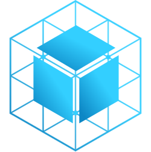
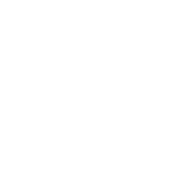

# WireBox

Official logo repository for **WireBox**, the powerful and lightweight dependency injection and AOP framework for ColdBox and CFML applications.

---

## 🖼️ Logo Variants

| Variant | Preview | Files |
|----------|----------|--------|
| **Full Color (Dark Text)** |  | **SVG:** [Large](./SVG/wirebox-logo-full-dark-L.svg) • [Medium](./SVG/wirebox-logo-full-dark-M.svg) • [Small](./SVG/wirebox-logo-full-dark-S.svg) **PNG:** [Large](./PNG/wirebox-logo-full-dark-L.png) • [Medium](./PNG/wirebox-logo-full-dark-M.png) • [Small](./PNG/wirebox-logo-full-dark-S.png) **JPG:** [Large](./JPG/wirebox-logo-full-dark-L.jpg) • [Medium](./JPG/wirebox-logo-full-dark-M.jpg) • [Small](./JPG/wirebox-logo-full-dark-S.jpg) |
| **Full Color (White Text)** |  | **SVG:** [Large](./SVG/wirebox-logo-full-light-L.svg) • [Medium](./SVG/wirebox-logo-full-light-M.svg) • [Small](./SVG/wirebox-logo-full-light-S.svg) **PNG:** [Large](./PNG/wirebox-logo-full-light-L.png) • [Medium](./PNG/wirebox-logo-full-light-M.png) • [Small](./PNG/wirebox-logo-full-light-S.png) **JPG:** [Large](./JPG/wirebox-logo-full-light-L.jpg) • [Medium](./JPG/wirebox-logo-full-light-M.jpg) • [Small](./JPG/wirebox-logo-full-light-S.jpg) |
| **Monochrome (Dark)** |  | **SVG:** [Large](./SVG/wirebox-logo-mono-dark-L.svg) • [Medium](./SVG/wirebox-logo-mono-dark-M.svg) • [Small](./SVG/wirebox-logo-mono-dark-S.svg) **PNG:** [Large](./PNG/wirebox-logo-mono-dark-L.png) • [Medium](./PNG/wirebox-logo-mono-dark-M.png) • [Small](./PNG/wirebox-logo-mono-dark-S.png) **JPG:** [Large](./JPG/wirebox-logo-mono-dark-L.jpg) • [Medium](./JPG/wirebox-logo-mono-dark-M.jpg) • [Small](./JPG/wirebox-logo-mono-dark-S.jpg) |
| **Monochrome (White)** |  | **SVG:** [Large](./SVG/wirebox-logo-mono-light-L.svg) • [Medium](./SVG/wirebox-logo-mono-light-M.svg) • [Small](./SVG/wirebox-logo-mono-light-S.svg) **PNG:** [Large](./PNG/wirebox-logo-mono-light-L.png) • [Medium](./PNG/wirebox-logo-mono-light-M.png) • [Small](./PNG/wirebox-logo-mono-light-S.png) **JPG:** [Large](./JPG/wirebox-logo-mono-light-L.jpg) • [Medium](./JPG/wirebox-logo-mono-light-M.jpg) • [Small](./JPG/wirebox-logo-mono-light-S.jpg) |
| **Icon – Full Color** |  | **SVG:** [Large](./SVG/wirebox-icon-full-L.svg) • [Medium](./SVG/wirebox-icon-full-M.svg) • [Small](./SVG/wirebox-icon-full-S.svg) **PNG:** [Large](./PNG/wirebox-icon-full-L.png) • [Medium](./PNG/wirebox-icon-full-M.png) • [Small](./PNG/wirebox-icon-full-S.png) **JPG:** [Large](./JPG/wirebox-icon-full-L.jpg) • [Medium](./JPG/wirebox-icon-full-M.jpg) • [Small](./JPG/wirebox-icon-full-S.jpg) |
| **Icon – Mono (Dark)** |  | **SVG:** [Large](./SVG/wirebox-icon-mono-dark-L.svg) • [Medium](./SVG/wirebox-icon-mono-dark-M.svg) • [Small](./SVG/wirebox-icon-mono-dark-S.svg) **PNG:** [Large](./PNG/wirebox-icon-mono-dark-L.png) • [Medium](./PNG/wirebox-icon-mono-dark-M.png) • [Small](./PNG/wirebox-icon-mono-dark-S.png) **JPG:** [Large](./JPG/wirebox-icon-mono-dark-L.jpg) • [Medium](./JPG/wirebox-icon-mono-dark-M.jpg) • [Small](./JPG/wirebox-icon-mono-dark-S.jpg) |
| **Icon – Mono (White)** |  | **SVG:** [Large](./SVG/wirebox-icon-mono-light-L.svg) • [Medium](./SVG/wirebox-icon-mono-light-M.svg) • [Small](./SVG/wirebox-icon-mono-light-S.svg) **PNG:** [Large](./PNG/wirebox-icon-mono-light-L.png) • [Medium](./PNG/wirebox-icon-mono-light-M.png) • [Small](./PNG/wirebox-icon-mono-light-S.png) **JPG:** [Large](./JPG/wirebox-icon-mono-light-L.jpg) • [Medium](./JPG/wirebox-icon-mono-light-M.jpg) • [Small](./JPG/wirebox-icon-mono-light-S.jpg) |

---

## 📝 Notes

- Use **Full Color (Dark Text)** for light backgrounds.  
- Use **Full Color (White Text)** for dark backgrounds.  
- Use **Monochrome** versions when color use is restricted (e.g., single-color print or embossing).  
- File naming convention: **wirebox-[logo|icon]-[variant]-[tone]-[size].[format]**

Example: `wirebox-logo-full-dark-M.svg`

---

## 🎨 Color Palette  

<table>
  <tr>
    <th>Light</th>
    <th>Med</th>
    <th>Dark</th>
  </tr>
  <tr>
    <td align="center">
       
      <b>Hex:</b> #33CFFF 
      <b>RGB:</b> 51, 207, 255
    </td>
    <td align="center">
       
      <b>Hex:</b> #0D87C5 
      <b>RGB:</b> 13, 135, 197
    </td>
    <td align="center">
       
      <b>Hex:</b> #1D3366 
      <b>RGB:</b> 29, 51, 102
    </td>
  </tr>
</table>

---

Ortus Brand Book 2025
